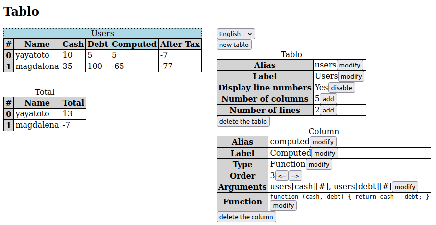

# tablos
Training project for VueJS. Tables with reactive columns. Unfinished yet.

## Install

My install works with these versions. Others could work.

- NVM version 0.38.0
- NPM version 7.15.1 **installed by NVM**
- Node version 16.3.0 **installed by NVM**

Having NPM and Node installed from NVM is mandatory for vue-cli,
which is listed in the dependencies in package.json

NPM can download the dependencies of the project with the following command :

`npm install`

## Launch

Run this command and browse at the url given

`npm run serve`

## Test

Run this command to run unit tests (they are uncomplete yet)

`npm run test:unit`

